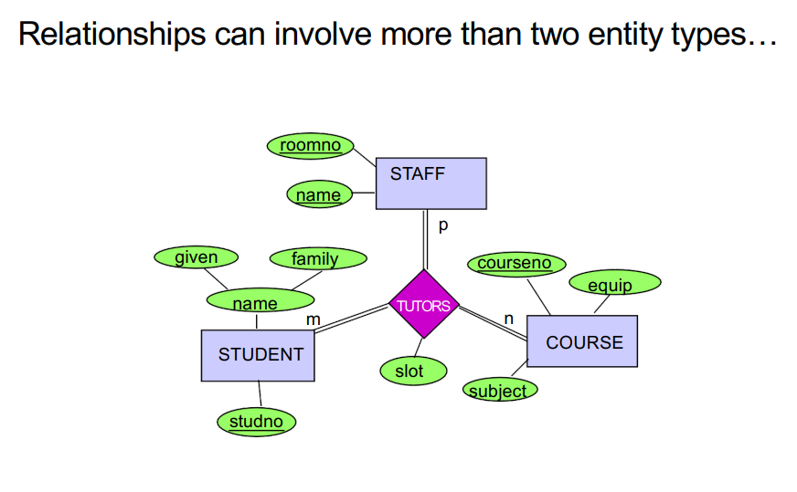
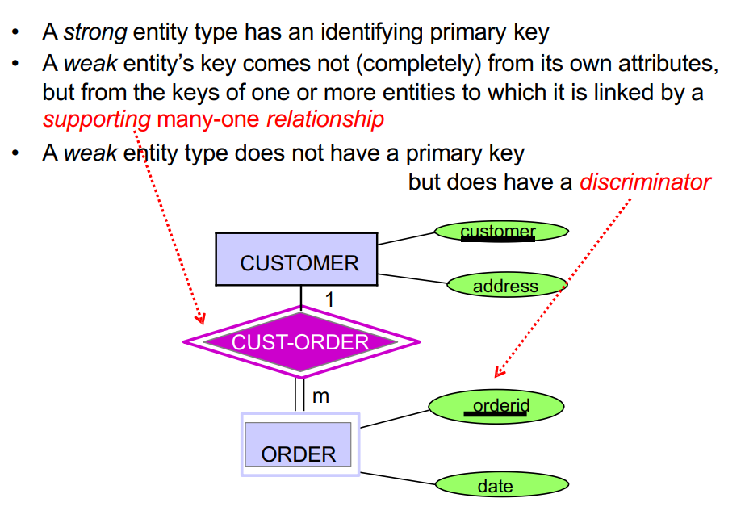
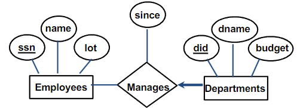

## Lec 2

### Entities

An object distinguishable from other objects(e.g., an employee)

- An entity is described by a set of attributes

### Entity Set/Entity Type:

A collection of similar entities (e.g., all employees)

- All entities in an entity set have the same set of attributes.
- Each attribute has a domain.
- Each entity set has a key

### Composite Keys

- Some entities cannot be uniquely identified by the values of a single attribute

- several attributes together make up a compoundkey

### Relationship:

An association between two or more entities

- Relationships may have attributes

### Relationship Set/Type:

A collection of similar relationships

### Roles and Recursive Relationships

An entity type can

- participate in several relationship sets
- participate more than once in one relationship set (taking on different “roles”)

### Participation Constraints

Participation constraints specify whether or not an entity must participate in a relationship set

- When there is no participation constraint, it is possible that an entity will not participate in a relationship set
- When there is a participation constraint, the entity must participate at least once
- Participation constraints are drawn using **adouble line** from the entity set to the relationship set

### Cardinality ratios

The number of instances of each of the participatingentity types which can partake in a single instance of the relationship type:

    1:1, 1:many, many:1, many:many

### Attributes

- For every attribute we define
  – Domain or data type
  – Format, i.e., composite or atomic
  – whether it is derived

- Every entity type must have as key an attribute ora set of attributes

#### Multivalued Attributes

- Students often have more than one phone number
- This captured by a multivalued attribute
- Notation: **double-lined oval**

### Multiway (non-binary) Relationship

### Constraints

- A constraint is an assertion about the database that must
  be true at all times
- Constraints are part of the database schema

Examples:

- Keys: social security number uniquely identifies a person
- Single-value constraints: a person can have only one father
- Referential integrity constraints: if you work for a company,
  it must exist in the database
- Domain constraints: peoples’ ages are between 0 and 150
- Cardinality constraints: at most 100 students enroll in a course

### Keys

A key is a set of attributes that
uniquely identify an object or entity

### Existence Constraints

Sometimes, the existence of an entity of type X
depends on the existence of an entity of type Y:

We call Y the dominating entity type and
X the subordinate type

### Strong and Weak Entities

- **Weak Entities May Depend on Other Weak Entities**

### Check some example from pg.37-pg.45

### Use the Schema to Enforce Constraints

- The conceptual schema should enforce
  as many constraints as possible
- Don't rely on future data to follow assumption

### Superclasses and Subclasses:

- Subclasses and Superclasses

  - A subclass entity type is a specialized type of a
    superclass entity type
  - A subclass entity type represents a subset or
    subgrouping of the superclass entity type’s instances

- Attribute Inheritance - Subclasses inherit properties (attributes) of their
  superclasses

#### Defining Superclasses and Subclasses

- Specialisation - The process of defining a set of more specialised entity types of
  an entity type
- Generalization - The process of defining a generalised entity type from a set of
  entity types

#### Constraints on Specialisation and Generalization

- Disjointness
  - Overlap：
    the same entity instance may be a member of more than one subclass of the specialisation
  - Disjoint：
    – the same entity instance may be a member of only one subclass
    of the specialisation
- Completeness
  - Total：
    every entity instance in the superclass must be a member of some
    subclass in the specialisation
  - Partial：
    – an entity instance in the superclass need not be a member of any
    subclass in the specialisation

## Lec 3

### Definitions

- A database is a collection of data which describes one or many
  real-world enterprises

- A DBMS is a software package designed to store and
  manage databases

- A database system = (Big) Data + DBMS + Application Programs

### Data Models

- A **data model** is a collection of high-level data description constructs
  that hide many low-level storage details
- A widely used data model called the **entity-relationship (ER)** model
  allows users to pictorially denote entities and the relationships
  among them

### The Relational Model

- A relation is basically a table (or a set) with rows (or records or
  tuples) and columns (or fields or attributes)

- Every relation has a schema, which describes the columns
  of a relation

### Queries in a DBMS

The relational model supports powerful query languages

- Relational calculus: a formal language based on mathematical logic
- Relational algebra: a formal language based on a collection of
  operators (e.g., selection and projection) for manipulating relations
- Structured Query Language (SQL)

### Transactions

An atomic sequence of database actions (read/writes)
is referred to as “transaction”

### Database Design

- Requirements Analysis
- Conceptual Design
- Logical Design
- Schema Refinement
- Physical Design
- Security Design

### Key Constraints

Each department can have at most one manager
Key constraints are denoted by **thin arrows**

### Total Constraints

Total participation + key constraint

### Weak Entities

A weak entity can be identified uniquely only by considering
the primary key of another (owner) entity

- Owner entity set and weak entity set **must participate in a one-to-many relationship set**
- Weak entity set **must have total participation** in this identifying relationship set

The set of attributes of a weak entity set that uniquely
identifies a weak entity for a given owner entity is called
**partial key**

## Lec 4

### Aggregation

Aggregation allows indicating that a relationship set (identified through
a dashed box) participates in another relationship set

- When to use aggregation? If we want to attach a
  relationship to a relationship

### Basic Constructs For relational model

The main construct in the relational model is the relation
A relation consists of:

1. A schema which includes:
   - The relation’s name
   - The name of each column
   - The domain of each column
2. An instance which is a set of tuples
   - Each tuple has the same number of columns as the
     relation schema

#### Domain Constraints

A relation schema specifies the domain of each column which entails **domain constraints**

- Who defines a domain constraint?
  DBA
- Who enforces a domain constraint?
  DBMS
- What is the relational database schema?
  A collection of schemas for the relations in the database
- What is the instance of a relational database?
  A collection of relation instances

### SQL

SQL (a.k.a. “Sequel”) stands for **Structured Query Language**

The SQL language has two main aspects

- Data Definition Language (DDL)

- Data Manipulation Language (DML)

### Integrity Constraints (ICs)

An IC is a condition that must be true for any instance
of the database

### Keys

- Keys help associate tuples in different relations
- Keys are one form of integrity constraints (ICs)

#### Superkey, Primary and Candidate Keys

- A set of fields is a superkey if:
  - No two distinct tuples can have same values in all key fields
- A set of fields is a primary key for a relation if:
  - It is a minimal superkey
- What if there is more than one key for a relation?
  - One of the keys is chosen (by DBA) to be the primary key
  - Other keys are called candidate keys

#### Foreign Keys

- A foreign key is a set of fields referring to a tuple
  in another relation
  - It must correspond to the primary key of the
    other relation
  - It acts like a `logical pointer’

#### Referential Integrity

- Default is NO ACTION (i.e.,
  delete/update is
  rejected)
- CASCADE (also delete all
  tuples that refer to the
  deleted tuple)
- SET NULL / SET DEFAULT (sets
  foreign key value of
  referencing tuple)

### Views
