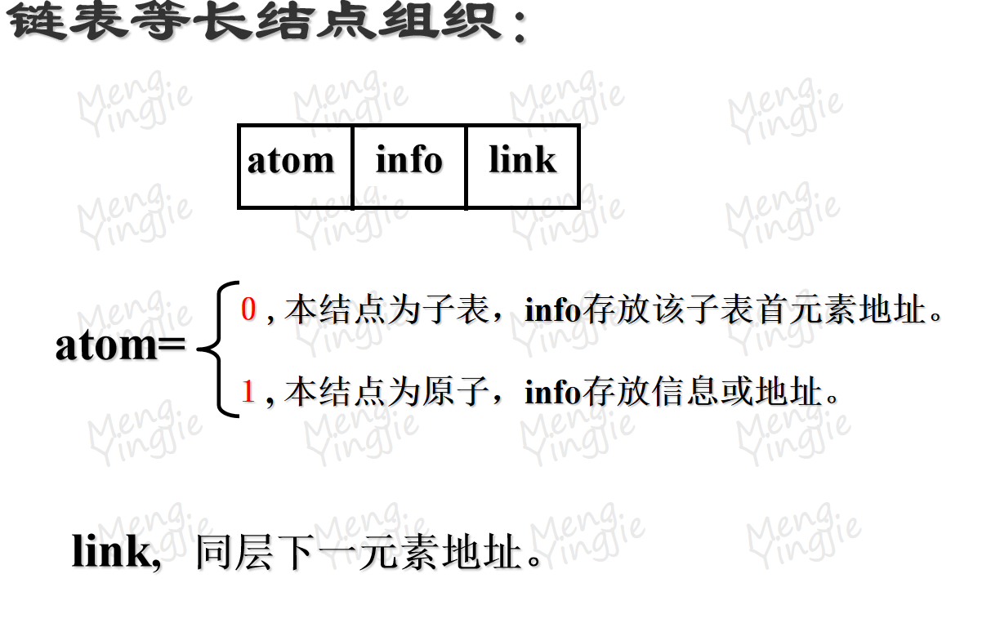

# 第一章

### 解释下列术语：信息、信息处理、数据、数据元素、数据项、数据对象、数据结构

(1) 信息: 是向人们提供的关于现实世界中有关事物的知识或者消息；

(2) 信息处理: 采用计算机对数据进行加工处理，包括对数据进行的接收及输入、存储、转化、传送、发布等的处理；

(3) 数据: 用以描述客观实体，并能被计算机识别的符号集；

(4) 数据元素: 用来描述现实客观实体的、具有完整确定意义的最小数据集；

(5) 数据项: 当某数据元素由若干个不可再分的数据要素构成时，每个要素称之为一个数据项；

(6) 数据对象: 具有相同性质的数据元素的集合,即同类数据的集合；

(7) 数据结构: 给定数据对象及其上面定义的操作(运算、关系)所共同构成的整体。

### 数据结构主要研究哪几个方面的内容？

研究的内容主要体现在三个方面：数据对象中数据元素间的逻辑关系、存储关系以及运算关系。

### 什么是数据的逻辑关系？

（1） 客观事物在自然形态下数据元素之间的一种联系( 或: 数据对象中数据元素之间的一种联系) ；

### 什么是数据的逻辑结构？

（2） 客观事物在自然形态下数据元素之间的所有联系( 或: 数据对象中数据元素之间逻辑关系的集合,即逻辑关系的集合)；

### 简要用事例说明常见的逻辑关系有哪几种类型。

（3）三种：线性（如班级成绩单、成员名单表）、树形（如单位的组织结构、家族族谱）、图（如城市交通图、人际关系图）。

### 什么是数据的物理关系？

（1）计算机存储器中数据元素之间的一种联系( 或: 计算机存储器中数据对象中的数据元素之间的一种联系) ；

### 什么是数据的物理结构？

（2）计算机存储器中数据元素之间的联系( 或: 数据对象在计算机存储器中联系,即物理关系的集合)；

### 目前常见的物理关系有哪几种类型。

（3）四种：顺序、链接、索引、哈希（散列）

### 顺序存储的具体存储方法；

（1）顺序存储方法：在存储区域中按照连续地址空间顺序依次地存放数据元素。

### 链接存储的具体存储方法。

（2）链接存储方法：数据结点所占的存储单元分为两部分，一部分存放结点本身的信息(数据项)，另一部分存放此结点关联的其它结点的信息(指针项) ，例如，它的后继结点所对应的存储单元的地址。

### 从资源的消耗来说，简单叙述数据结构的优劣主要从哪几个方面进行评价？

从资源的消耗来说,基本说来有两条标准：

时间: 作为问题的参数的函数来计算时间效率,即时间复杂度

空间: 作为问题的参数的函数来计算存储需要量,即空间复杂度。

# 第二章

### 解释下列术语：(1)算法; (2)过程; (3)时间复杂性; (4)空间复杂性; (5)有效算法; (6)难解性问题; (7)PDL 语言; (8)标识符

(1) 算法:是解决某个问题的的指令的有限集合,此外，每个算法都必须符合有穷性、确定性、有效性以及输入/输出等准则。

(2) 过程: 事物发展或事物进行所经过的程序，即次序。

(3) 时间复杂性：利用某算法处理一个问题规模为 n 的输入所需要的时间。

(4) 空间复杂性：利用某算法处理一个问题规模为 n 的输入所需要的存储空间。

(5) 有效算法：以多项式时间为界的算法。

(6) 难解性问题：如果一个问题不存在多项式时间算法，则称它是难解的。

(7) PDL 语言：是一种用于描述功能模块部件的算法设计语言。或 保留计算机程序设计语言的框架和描述形式，并去掉其特异性和枝节要求，再结合自然语言所形成的语言。

(8) 标识符：语言中由字符按照一定规则形成的具有特定含义的词。

### 过程基于其目的要求主要可以分为哪几类？

一般过程:关注经历、体验，只要做了就行

函数过程:关注得到的“值”，即结果。

### (1)算法评价的主要目的是什么？

(1)目的：比较不同算法，从而能够选择高效算法

### (2)一个好的算法应当遵循哪几个准则？

(2)评价遵循的主要准则：正确性、易读性、健壮性、高效性

### (1).算法时间复杂性的评价一般经过哪几个主要步骤？

(1)时间复杂性评价主要步骤:

1.确定标准操作;

2.计算标准操作次数;

3.构造标准操作次数函数;

4.确定函数阶；

### (2).空间复杂性的分析重点关注什么空间的消耗？

(2)空间复杂性的分析重点关注:附加空间的消耗

### 常见的算法描述形式一般有哪几种？

1.计算机程序设计语言

2.自然语言

3.PDL 语言

4.流程图

### PDL 语言主要有哪些优势？

1.表达能力强，具有关键字的固定语法，同时提供了结构化控制结构、数据说明和模块化的特点。

2.类似自然语言表达习惯，结构清晰、简单、可读性好。

3.易于转化为任何一种程序设计语言代码。

### 就数据处理而言，计算机语言一般都包含有哪几种基本语句类型？

1.赋值语句

2.条件语句

3.循环语句

4.输入语句

5.输出语句

# 第三章

### 解释下列术语： (1).线性表; (2).顺序表; (3).链表; (4).表头结点; (5).静态链表

(1) 线性表: 是 n≥0 个数据元素 a1,a2,…,an 的有限序列，在序列中除第一个和最后一个以外,每个元素有且仅有一个直接前驱和直接后继。

(2) 顺序表：采用顺序存储方式组织的线性表。

(3) 链表: 通过指针联系起来的结点的整体。

(4) 表头结点: 给链表增加的一个附加结点，该结点一般放置于链表的最前面,但该结点不用以存储数据元素。

(5)静态链表: 以整型变量的值作为存储链接的指针值,从而联系起来的结点的整体。

### 线性表的特性

是数据元素的有限序列。

元素之间呈线性关系。

### 线性表的向量表示

#### 基于向量的存储方法:

在所给地址空间中顺序地分配存储单元，且每个数据元素占据相同
大小的存储空间单元。

#### 向量存储方法的特性:

存储分配上呈线性结构。
属于随机存储结构

### 边界条件

在算法设计中对于以上的参数异常 (即边界条件)导致的
运算不能正常执行的情况，我们称为边界情况，也就是说应该对
其进行约束。(保证健壮性、完备性)

# 第四章

### 解释下列术语：(1).栈; (2).队列; (3).循环队列; (4).假溢出; (5).递归函数

(1) 栈: 它是一个下限为常数，上限可变化的向量（或者反之）。

(2) 队列: 它是一个下限和上限只能增加而不能减少的向量（或者反之）。

(3) 循环队列：将向量空间的首、尾单元通过一定的关系形成逻辑环状来组织的队列。

(4) 假溢出：分配的存储空间未满，但由于存储方法或管理模式导致的数据元素无法存入的一种现象。

(5) 递归函数:一个函数程问题的定义中又应用了它自身,那么该函数称为是递归定义的，该函数也称为递归函数。

### 递归程序设计中需关注两个重要问题

基本项：列出 1 个或几个被定义的函数(规约终止条件)。即，回答最小规模下问题解决的方案

列出如何由已找到的结论求得未知结论的函数(规约如何递归)。即，回答大规模问题如何由小规模问题解决的方案

### 简述以下问题：（1）栈与线性表的异同；（2）队列与线性表的异同。

(1) 栈与线性表的异同:

同：栈、线性表的数据对象及其数据元素间逻辑关系相同，故它们都属于线性结构；

异：需求(即运算)不同，栈的运算是线性表的一个子集,而且这个子集还要加以约束,即若限定线性表的运算只有插入和删除那么可以认为栈是只允许在表的一端进行插入和删除。

(2) 队列与线性表的关系:

同：队列、线性表的数据对象及其数据元素间逻辑关系相同，故它们都属于线性结构；

异：需求(即运算)不同，队列的运算是线性表的一个子集,而且这个子集还要加以约束,即若限定线性表的运算只有插入和删除那么可以认为队列只允许在表的一端进行插入，在另外一端进行删除。

# 第五章

### 解释术语： (1).串； (2).空串； (3).子串/主串； (4).模式匹配； (5).串的模式匹配

(1) 串：它是一个由零个或多个字符组成的有穷序。

(2) 空串：串长为零的串。

(3) 子串/主串：一个串中任意个连续字符组成的子序列称为该串的子串，该串成为它的所有子串的主串。

(4) 模式匹配：在模式分类或问答系统当中，把从目标中查找模式的运算过程称为模式匹配。

(5) 串的模式匹配：把从目标串中查找模式串的运算过程称为串的模式匹配。

### 简述下列问题：(1).串的相等需满足什么条件？(2).空串与空白串是否相同？为何?(3).串的主要存储方式有哪几种？

(1).串长相等，且各对应位置字符相同。

(2).不同。

空串:不包含字符,其串长为零;

空白串:由空白字符组成,其串长不等于零.

(3).主要存储方式有三种：顺序、索引、链接

### KMP 算法

主要目的是消除正文指针的回溯,因此算法效率有某种程度的改进。

# 第六章

### 解释术语： (1). 数组 ； (2). 虚拟地址 ； (3). 特殊矩阵 ； (4). 稀疏矩阵 ； (5). 广义表

(1) .数组:1 维数组是个向量，它的每个元素是该结构中不可分割的最小单位；n(n>1)维数组是个向量，它的每个元素是 n-1 维数组，且具有相同的下限和上限。

(2) .虚拟地址：数组地址访问公式中的常数项之和，将该值称为虚拟地址。

(3) .特殊矩阵: 在一个矩阵中和某元素比较而言,不相同的元素很少，且其分布具有规律时,我们称此矩阵为特殊矩阵。

(4) .稀疏矩阵: 在一个矩阵中和某元素比较而言,不相同的元素很少时,我们称此矩阵为稀疏矩阵。

(5) .广义表:是零个或多个原子或子表所组成的有限序列

### 什么是向量？

向量：标量(只有量值而无方向的量)的一维的有序集合；

### 向量特性

- 均匀性：各元素须具有相同的结构形式，即，元素的类型、长度等都相同。
- 有序性：各元素有序，有序性通过使用标号标识，所有标号都是整数。

### 稀疏矩阵与特殊矩阵有何异同？

相同点：都是出现了大面积的相同元素;
不同点: 特殊矩阵中大面积相同元素的分布有规律可循,但在稀疏矩阵中无规律可循.

### 数组与向量的关系:

物理关系:向量是数组的特例(一维数组就是向量),
且具有复杂的访问公式

逻辑关系:数组是向量的扩充(向量的向量)

### 向量的向量是否一定是数组?

对于向量的向量进行约束，使得子向量具有相同的上下限一数组

### 多维数组地址访问

### 特殊数组

### 顺序存储

按照行(或列)优先的原则 ,将矩阵中的非零元素顺序存放,为便于检索和存取,一般须带有适当的辅助信息。

具体有三种模式：

- 三元组表示
- 索引表示(二元组表示)
- 伪地址表示

#### 三元组

将矩阵的全部非零元素抽象为一个线性表，每个元素含行、列、值三个数据项。

##### 三元组的缺陷

不利于矩阵元素变化：

- 由非零变为零引起删除运算。
- 由零变为非零引起插入运算。

#### 索引表示(二元组表示)

三元组中数据元素按 row 呈有序状态(行优先次序决定),故可建立行索引表。

##### 索引表示法的优点：

1. 比三元组节省存储单元，空间需要量 O(2p+n+1).
2. 检索速度比三元组快

##### 索引表示法的缺点：

矩阵变化时比三元组适应能力更差,不仅要变化主表还要修改索引表。

#### 伪地址表示

按照非零元在矩阵中出现的相对次序作为元素的地址映射关系来组织元素次序(在行或列优先的次序下)。

存储空间需要 O(2p)个单元.比前两种省，但需付出计算伪地址的时间，元素 aij 的伪地址为：(i-1) \*n+j,先计算伪地址再到主表中用二分法查找。时间代价： O(log2p)

### 链接存储

顺序存储空间可大幅度节省，但矩阵出现变异(非零元增减时)会带来不变，链接可克服这一不足。

#### 单链表表示

#### 十字链表表示

### 散列存储

通常以元素的行、列下标值作为参数构造散列函数。

散列中须包含行列信息以便在检索中判别冲突问题。

- 优点：存取非零元速度快。
- 缺点：寻找某行(或列)所有非零元困难，这恰是矩阵常常需要的。

### 稀疏矩阵运算

特殊的存储结构须设计特殊的运算过程，注意保持结构的一致性。

- 矩阵转置
- 矩阵相乘
- 矩阵相加

### 广义表

是零个或多个原子或子表所组成的有限序列

- 原子:它是所要措述的某种类型的对象。是一个确定的概念
- 子表: 作为构成元素的表称为被构成表的子表
- 原子与表的差别:原子是作为结构上不可分的成分，而表则是有结构(包含关系集)的。
- 广义表的长度，一个表中所包含的元素(原子或子表)的个数。长度为零的表称为空表。
- 广义表的深度,一个表中元素的层次数的 max 值.
- 元素的层次数,包含该元素的括号对数.

#### 特性

- 定义是递归的.可以认为是线性表的推广，因为元素可以又是一个广义表，而线性表限制每个元素必须是原子。
- 定义没有限制元素的共享性和递归性.
  - 共享性：允许共享其它广义表，对其它广义表可通过表名称直接引用。例:A=(x,L)中对 L 的引用.
  - 递归性：广义表可用自身作为元素使用。例,D=(z,D)

#### 存储

存储方法很多，线性表的各种存储结构及以后非线性结构中所用的存储方式均可使用.

- 顺序方式
- 链表方式

